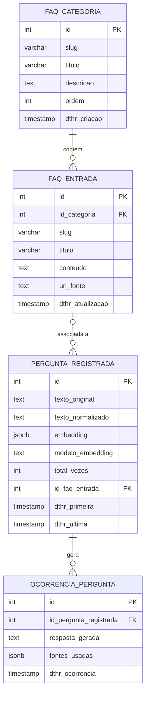

# Estrutura do Banco de Dados

## Tabelas

O banco possui quatro tabelas organizadas em dois domínios:

**FAQ (conteúdo)**
| Tabela | Descrição |
|---|---|
| `faq_categoria` | Categorias do FAQ (ex: Matrícula, Estrutura Curricular) |
| `faq_entrada` | Perguntas e respostas do FAQ, vinculadas a uma categoria |

**Análise de uso (anônima e agregada)**
| Tabela | Descrição |
|---|---|
| `pergunta_registrada` | Agrega perguntas semanticamente similares — uma linha por "pergunta única" |
| `ocorrencia_pergunta` | Registra cada vez que uma pergunta é feita — permite análise temporal |

---

## Por que duas tabelas para análise?

**`pergunta_registrada`** é a tabela agregada: mantém um contador (`total_vezes`) e
uma amostra do texto da pergunta. Quando o chatbot recebe uma nova pergunta, o sistema
calcula a similaridade entre o novo embedding e os já armazenados. Se a pergunta for
semanticamente similar a uma existente (similaridade ≥ threshold), apenas o contador é
incrementado — sem criar nova linha. Isso agrupa paráfrases como
*"como faço matrícula"* e *"como me matriculo"* como a mesma pergunta.

**`ocorrencia_pergunta`** é o log individual: registra cada ocorrência com a resposta
gerada e as fontes usadas pelo RAG. Isso permite perguntas como *"quais perguntas mais
cresceram nos últimos 7 dias?"* além do ranking geral por `total_vezes`.

---

## Agrupamento por embedding (similaridade de cosseno)

### Como funciona

A pergunta não é agrupada por texto idêntico, mas por **proximidade semântica dos
vetores de embedding**. O embedding de cada pergunta nova é comparado com os vetores
armazenados usando similaridade de cosseno. Se o maior score ≥ `THRESHOLD_MESMA_PERGUNTA`,
a pergunta é considerada a mesma e o contador é incrementado.

### Threshold de calibração

O valor inicial é **0.92** (ver `fiaq-app/server/utils-perguntas/similaridade.ts`).
É um parâmetro de tuning a ajustar com dados reais:

- **Perguntas diferentes sendo agrupadas juntas** → subir o threshold (0.93, 0.95…)
- **Paráfrases da mesma pergunta ficando separadas** → descer o threshold (0.90, 0.88…)

### Dependência do modelo

O campo `modelo_embedding` é obrigatório porque **vetores de modelos diferentes não
são comparáveis entre si** — um vetor do `nomic-embed-text` e um do `llama-nemotron`
para o mesmo texto produzem números completamente diferentes. A comparação de
similaridade só ocorre entre perguntas do mesmo modelo.

### Evolução futura para pgvector

O volume esperado (centenas a poucos milhares de perguntas) permite carregar todos os
vetores em memória e comparar em TypeScript — o mesmo padrão do `vectorStore.ts` da
squad de IA. Se o volume crescer a ponto de tornar isso ineficiente, a migração natural é:

1. Instalar a extensão `pgvector` no Postgres (`CREATE EXTENSION vector`)
2. Substituir a coluna `embedding JSONB` por `embedding vector(N)` (N = dimensão do modelo)
3. Criar índice `HNSW` ou `IVFFlat` na coluna
4. Substituir o cálculo TypeScript por `ORDER BY embedding <=> $vetor LIMIT 1` no SQL

---

## Diagrama Entidade-Relacionamento

---

## Histórico de decisões

| Data | Decisão | Motivo |
|---|---|---|
| 2026-06 | Autenticação e histórico individual removidos do escopo | Por orientação do professor, o sistema não cadastra nem identifica usuários. Evita burocracia de LGPD e mantém o foco no produto (FAQ + chatbot). |
| 2026-06 | Auth substituído por agregação anônima de perguntas | Permite detectar perguntas em alta e controlar qualidade das respostas mais frequentes sem armazenar dados pessoais. |
| 2026-06 | `embedding JSONB` em vez de `pgvector` | Volume esperado não justifica pgvector agora. Mesma abordagem do `vectorStore.ts` da squad de IA. Migração documentada acima como evolução natural. |

> **Autores/Decisões originais:** Gustavo Pavanelli e Lucas Centurion
>
> **Revisão 2026-06:** Gustavo Pavanelli — mudança de escopo por orientação do professor:
> remoção de auth e histórico individual; adição de análise anônima e agregada de perguntas.
