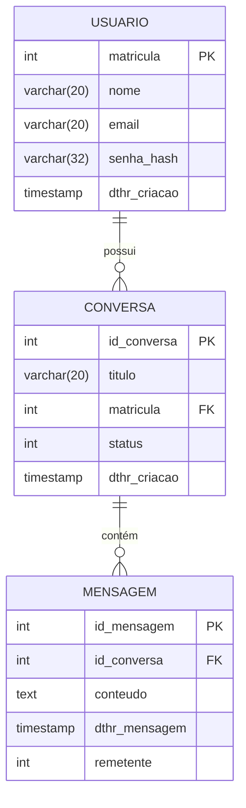

# Estrutura do Banco de Dados

O sistema inicial contará com 3 tabelas: `usuario`, `conversa` e `mensagem`. Assim, um usuário poderá acessar conversas anteriores ao fazer login.

* **Usuários:** O identificador único do usuário será sua própria matrícula da UnB, já o email poderá ser de escolha do aluno. A senha será armazenada de forma segura criptografada por uma função hash.
* **Conversas:** Cada aluno poderá ter quantas conversas quiser e cada uma terá um título para fácil identificação. Serão salvas as datas de criação e de última modificação, esta última servirá para ordenação das conversas, deixando a última modificada mais acessível (maior probabilidade de retorno). Além disso, todas as conversas terão um `status` inteiro que pode ser `0` (em andamento) ou `1` (finalizada). Isso servirá de consulta para entender se o ChatBot está conseguindo resolver a dúvida do aluno por completo ou não.
* **Mensagens:** Cada conversa será composta por mensagens, ordenadas pelo horário de escrita. O campo `remetente` será um inteiro indicando `0` (usuário) ou `1` (bot), o que definirá o lado em que o balão deverá aparecer na tela e simbolizará o autor da mensagem.

> **Autores/Decisões:** Gustavo Pavanelli e Lucas Centurion

---

## Diagrama Entidade-Relacionamento

