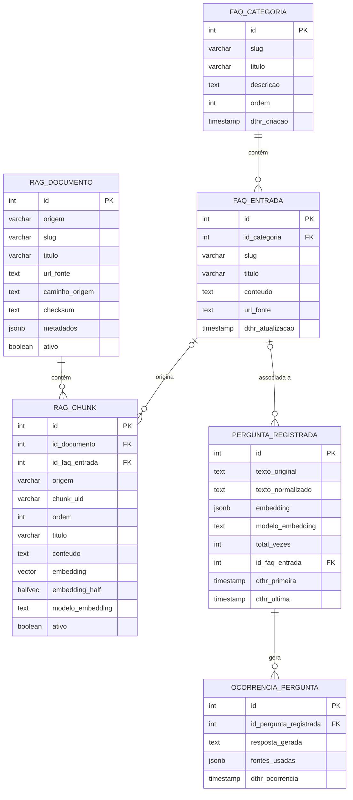

# Estrutura do Banco de Dados

## Tabelas

O banco possui seis tabelas organizadas em três domínios:

**FAQ (conteúdo)**
| Tabela | Descrição |
|---|---|
| `faq_categoria` | Categorias do FAQ (ex: Matrícula, Estrutura Curricular) |
| `faq_entrada` | Perguntas e respostas do FAQ, vinculadas a uma categoria |

**RAG (base de conhecimento)**
| Tabela | Descrição |
|---|---|
| `rag_documento` | Fonte de conhecimento: FAQ, PDF ou página crawleada |
| `rag_chunk` | Trechos indexados com embedding `pgvector` para busca semântica |

**Análise de uso (anônima e agregada)**
| Tabela | Descrição |
|---|---|
| `pergunta_registrada` | Agrega perguntas semanticamente similares — uma linha por "pergunta única" |
| `ocorrencia_pergunta` | Registra cada vez que uma pergunta é feita — permite análise temporal |

---

## Arquitetura RAG no banco

O chatbot usa uma arquitetura **DB-first**:

1. `/api/chat` gera o embedding da pergunta com o modelo configurado.
2. O backend chama `buscar_rag_chunks(...)` no Postgres.
3. A função busca candidatos em `rag_chunk` usando cosine distance (`<=>`) com
   `pgvector`, aplica threshold e retorna os melhores trechos.
4. O modelo de chat (`openrouter/free`) recebe os trechos como contexto.
5. A pergunta e as fontes usadas são registradas nas tabelas de análise.

O modelo de chat e o modelo de embedding são papéis diferentes. `openrouter/free`
roteia a escrita da resposta entre modelos gratuitos; o embedding model transforma
perguntas e chunks em vetores. O deploy usa
`nvidia/llama-nemotron-embed-vl-1b-v2:free`, com 2048 dimensões, por isso
`rag_chunk.embedding` é `extensions.vector(2048)`.

Para manter a busca eficiente com 2048 dimensões, `rag_chunk` também possui
`embedding_half extensions.halfvec(2048)` gerado automaticamente. A função
`buscar_rag_chunks(...)` usa o índice HNSW em `embedding_half` para selecionar
candidatos e reordena pelo vetor completo dentro dessa amostra.

O arquivo `fiaq-app/server/assets/rag-index.json` continua no repo apenas como
fallback de compatibilidade caso o banco esteja indisponível durante desenvolvimento
ou recuperação.

---

## Por que duas tabelas para análise?

**`pergunta_registrada`** é a tabela agregada: mantém um contador (`total_vezes`) e
uma amostra do texto da pergunta. Quando o chatbot recebe uma nova pergunta, o sistema
calcula a similaridade entre o novo embedding e os já armazenados. Se a pergunta for
semanticamente similar a uma existente (similaridade ≥ threshold), apenas o contador é
incrementado — sem criar nova linha. Isso agrupa paráfrases como
*"como faço matrícula"* e *"como me matriculo"* como a mesma pergunta.

**`ocorrencia_pergunta`** é o log individual: registra cada ocorrência com a resposta
gerada e as fontes usadas pelo RAG. Isso permite perguntas como *"quais perguntas mais
cresceram nos últimos 7 dias?"* além do ranking geral por `total_vezes`.

---

## Agrupamento por embedding (similaridade de cosseno)

### Como funciona

A pergunta não é agrupada por texto idêntico, mas por **proximidade semântica dos
vetores de embedding**. O embedding de cada pergunta nova é comparado com os vetores
armazenados usando similaridade de cosseno. Se o maior score ≥ `THRESHOLD_MESMA_PERGUNTA`,
a pergunta é considerada a mesma e o contador é incrementado.

### Threshold de calibração

O valor inicial é **0.92** (ver `fiaq-app/server/utils-perguntas/similaridade.ts`).
É um parâmetro de tuning a ajustar com dados reais:

- **Perguntas diferentes sendo agrupadas juntas** → subir o threshold (0.93, 0.95…)
- **Paráfrases da mesma pergunta ficando separadas** → descer o threshold (0.90, 0.88…)

### Dependência do modelo

O campo `modelo_embedding` é obrigatório porque **vetores de modelos diferentes não
são comparáveis entre si** — um vetor do `nomic-embed-text` e um do `llama-nemotron`
para o mesmo texto produzem números completamente diferentes. A comparação de
similaridade só ocorre entre perguntas do mesmo modelo.

### pgvector no RAG e JSONB nas métricas

O RAG usa `pgvector` porque a busca semântica precisa ser rápida e ordenável no
banco. Já `pergunta_registrada.embedding` continua como `JSONB` porque o volume de
métricas é pequeno e a agregação de perguntas equivalentes ainda roda em TypeScript.
Se a tabela de métricas crescer muito, ela pode seguir a mesma estratégia do RAG.

---

## Diagrama Entidade-Relacionamento

---

## Histórico de decisões

| Data | Decisão | Motivo |
|---|---|---|
| 2026-06 | Autenticação e histórico individual removidos do escopo | Por orientação do professor, o sistema não cadastra nem identifica usuários. Evita burocracia de LGPD e mantém o foco no produto (FAQ + chatbot). |
| 2026-06 | Auth substituído por agregação anônima de perguntas | Permite detectar perguntas em alta e controlar qualidade das respostas mais frequentes sem armazenar dados pessoais. |
| 2026-06 | RAG migrado para `pgvector` | Organiza todo o conhecimento no banco, permite seed idempotente e deixa o JSON apenas como fallback. |
| 2026-06 | Métricas mantêm `embedding JSONB` | A agregação anônima ainda tem baixo volume; evita complexidade extra fora do caminho crítico do RAG. |

> **Autores/Decisões originais:** Gustavo Pavanelli e Lucas Centurion
>
> **Revisão 2026-06:** Gustavo Pavanelli — mudança de escopo por orientação do professor:
> remoção de auth e histórico individual; adição de análise anônima e agregada de perguntas.
